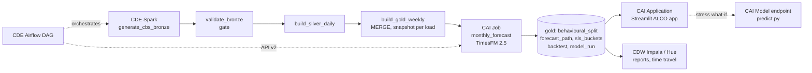
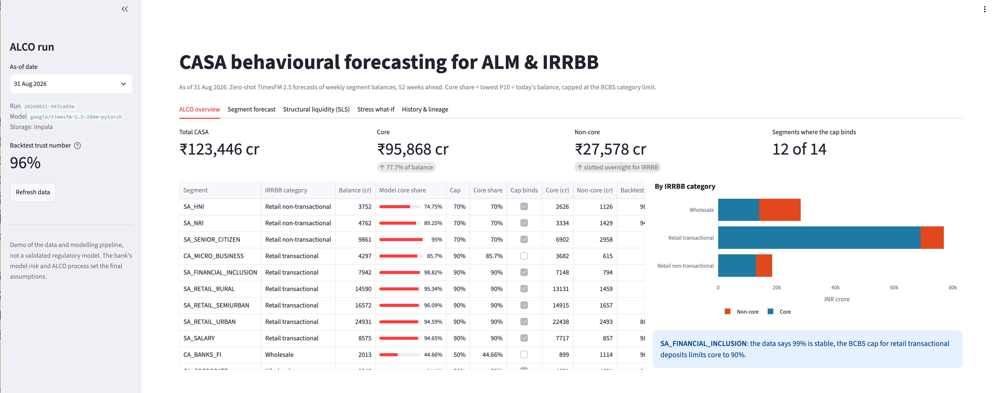

# ALM & IRRBB: CASA Behavioural Forecasting on Cloudera

CASA (current and savings account) deposits have no contractual maturity, so a
bank's Structural Liquidity Statement (ALM) and IRRBB models both depend on a
behavioural assumption: how much of today's balance is stable (core), and for
how long. This project refreshes that assumption every month from governed
Iceberg data, with a zero-shot Google **TimesFM 2.5** forecast and full lineage
from the core banking extract to the ALCO report.

> Demo of the data and modelling pipeline, not a validated regulatory model. It
> covers volume behaviour only; repricing maturity, pass-through and rate
> sensitivity under shocks need further modelling. The bank's model risk and
> ALCO process set the final assumptions.

## Architecture



| Layer | Cloudera service | Code |
|---|---|---|
| Ingest + medallion | CDE Spark, Iceberg | `cde/jobs/` |
| Orchestration | CDE Airflow | `cde/dags/casa_alm_dag.py` |
| Forecast + core split | CAI Job | `cai/jobs/monthly_forecast.py` |
| What-if API | CAI Model Deployment | `cai/model/predict.py` |
| Reports, time travel | CDW Impala (Hue) | `sql/reports.sql` |
| Demo UI | CAI Application | `app/` |

Databases: `rsingh_casa_alb_bronze`, `_silver`, `_gold`, `_ref` (prefix in
`config/casa.yaml`, and `--db-prefix` / `DB_PREFIX` for the CDE side).

| Table | Written by | Grain |
|---|---|---|
| `bronze.cbs_daily_balance` | CDE generate | account × day (synthetic CBS extract, ~2.5M rows) |
| `ref.casa_segment_map` | CDE generate | product × customer type → segment, IRRBB category |
| `silver.casa_daily_balance` | CDE silver | segment × day |
| `gold.casa_weekly_balance` | CDE gold (MERGE) | segment × Sat–Fri week, INR crore |
| `gold.casa_behavioural_split` | CAI job | as-of × segment: core share, cap, core / non-core |
| `gold.casa_forecast_path` | CAI job | as-of × segment × week: P10 / P50 / P90 |
| `gold.casa_sls_buckets` | CAI job | as-of × segment × RBI bucket × component |
| `gold.casa_backtest_metrics` | CAI job | as-of × segment × cut-off |
| `gold.casa_model_run` | CAI job | as-of: model revision, input snapshot id, trust number |

## Method

Set in `config/policy.yaml`:

- **Core share (model)** = lowest P10 over the next 52 weeks ÷ today's balance.
- **Core share** = min(model share, BCBS d368 cap): retail transactional 90%,
  retail non-transactional 70%, wholesale 50%. Non-core is slotted overnight for IRRBB.
- **SLS slotting** of today's balance, always adding back to it:
  run-off to the running minimum of the P10 path goes into Day 1 to 1 year by the
  week it happens; the balance the model calls stable but the cap does not allow
  goes into Day 1; core is spread over 1–3y / 3–5y / 5y+ with category weights
  whose average maturity stays within the BCBS limit (5 / 4.5 / 4 years).
- **Trust number**: rolling-origin backtests (4 cut-offs × 13 hidden weeks). The share of
  actual segment-weeks above P10 should be about 90%; inside P10–P90 about 80%.

Synthetic data: 14 segments from April 2021, with trend, salary cycle,
quarter-end and March spikes, festival season, the 2022–23 rate-hike outflow
and partial return after the 2025 cuts. HNI savings has been in structural
decline since mid-2025 and interbank current accounts are very volatile, so
some segments sit below their cap. History is prefix-stable: a later as-of
date only adds weeks, like real monthly loads.

## Run locally

Python 3.11 and Java 17.

```bash
python3.11 -m venv .venv && .venv/bin/pip install -r requirements-dev.txt
export HF_HOME=$PWD/.hf_cache

# CDE jobs on local Spark + Iceberg, then export gold weekly to data/parquet
.venv/bin/python scripts/run_cde_local.py all                 # as of yesterday
.venv/bin/python scripts/run_cde_local.py history             # Iceberg snapshots

# CAI jobs on parquet (first run downloads TimesFM, ~900 MB)
.venv/bin/python cai/jobs/backfill_alco_history.py --months 6 --backend parquet
.venv/bin/python cai/jobs/monthly_forecast.py --backend parquet
.venv/bin/python cai/model/test_endpoint.py --local --backend parquet --segment SA_RETAIL_URBAN --stress-cut 0.10

CASA_STORAGE_BACKEND=parquet .venv/bin/streamlit run app/streamlit_app.py
.venv/bin/pytest -q
```

## Deploy on Cloudera

Runs on the **federal** CDP environment since 3 Oct 2026 (go01 before; its resources
were left as they were). Every resource carries the `rsingh-casa-alb` /
`rsingh_casa_alb` prefix. Measured timings and IDs: [`docs/PROJECT_LOG.md`](docs/PROJECT_LOG.md).

| What | federal |
|---|---|
| CDW Impala | `coordinator-federal-impala-1.dw-federal-cdp-env.dp5i-5vkq.cloudera.site`, 443, HTTP `cliservice`, TLS, LDAP |
| CDE | shared vcluster; queue caps at 27 vCPU / ~110 GB |
| CAI | workbench `federal-cml-ws`, CPU only (4 vCPU / 16 GB per engine at most) |

Secrets live in `.env` (gitignored; copy `.env.example`) and are loaded with
`set -a; source .env; set +a`. Scripts never print them.

### 1. CDE: Spark jobs

CDE CLI configured for the vcluster (`~/.cde/config.yaml`), repo pushed to GitHub.

```bash
./cde/scripts/deploy_jobs.sh      # CDE Repository rsingh-casa-alb-pipeline, python-env, 4 Spark jobs
./cde/scripts/backfill_drill.sh   # optional: 6 month-end loads = 6 gold snapshots
```

Jobs get a 2-core / 4 GB driver and 2-core / 4 GB executors (1 min / 2 initial / 4 max),
each overridable (`DRIVER_CORES`, `DRIVER_MEMORY`, `EXECUTOR_CORES`, `EXECUTOR_MEMORY`,
`MIN_EXECUTORS`, `INITIAL_EXECUTORS`, `MAX_EXECUTORS`): the shared queue rejects a job
whose driver plus initial executors do not fit ("cannot fit application").
`cde job run --wait` can return before the run ends; poll `cde run describe --id <id>`.

After a code change: `git push`, then `cde repository sync --name rsingh-casa-alb-pipeline`
(re-run `deploy_dag.sh` if the DAG changed). On a shared vcluster the first job
after idle can wait for scale-up (`cde run describe --id <id>` shows
`waiting-for-scale-up`).

### 2. CAI: project, jobs, model, app (scripted)

`ci/setup_cai.py` drives the CAI API v2 from the laptop and is idempotent: it finds each
resource by name, creates what is missing and fixes what drifted, so a re-run after a
dropped connection converges. The resources are declared in `ci/cai_jobs.py`.

```bash
set -a; source .env; set +a       # CASA_CAI_HOST, CASA_CAI_API_KEY, CASA_IMPALA_USER/_PASSWORD
python ci/setup_cai.py --dry-run                 # what would change
python ci/setup_cai.py --no-serving --sync       # project, env vars, 3 jobs; sync-code installs requirements
# first ALCO run: start rsingh-casa-alb-monthly-forecast (CAI UI or API) with CASA_AS_OF=YYYY-MM-DD
CASA_ENDPOINT_API_KEY=$CASA_CAI_API_KEY python ci/setup_cai.py --sync   # + model and app
python ci/setup_cai.py --dataviz                 # Data Visualization connection + dashboards
```

| Resource | Name | Engine |
|---|---|---|
| Project | `rsingh-casa-alb` (from this repo) | env: `HF_HOME=/home/cdsw/.hf_cache`, `CASA_IMPALA_*`, `CASA_ENDPOINT_*` |
| Jobs | see [`docs/DEMO_RUNBOOK.md`](docs/DEMO_RUNBOOK.md#cai-jobs) | CPU only |
| Model | `rsingh-casa-alb-model`, `cai/model/predict.py`, function `predict`, auth on | 2 vCPU / 8 GB |
| Application | `rsingh-casa-alb-alco`, subdomain `rsingh-casa-alb-alco`, `app/run.py` | 2 vCPU / 4 GB |

The CAI runtime is CPU only: `requirements.txt` pulls the CPU torch wheels, and TimesFM
2.5 (~900 MB) downloads from Hugging Face into `HF_HOME` on first use. A job run
ignores arguments, so everything goes through the run's environment: `CASA_AS_OF`,
`CASA_TRIGGERED_BY`, `CASA_DRY_RUN=1` (compute, write nothing), `CASA_BACKFILL_MONTHS`.
The backfill runs each month-end in its own process and fails by name if one dies.
A killed engine can still be reported as `ENGINE_SUCCEEDED`, so after any run check that
the as-of row exists in `rsingh_casa_alb_gold.casa_model_run`.

The app's stress tab calls the model endpoint (`CASA_ENDPOINT_URL`, `_ACCESS_KEY`,
`_API_KEY` in the project environment); without them it runs TimesFM in the app (give it
8 GB then).



The same ALCO pack is also a Cloudera Data Visualization dashboard on CDW,
**rsingh-casa-alb - CASA ALCO** (4 sheets, 14 visuals over the views in
`sql/dataviz_views.sql`), built as code by `dataviz/build_dashboard.py`; see
[`docs/DATAVIZ.md`](docs/DATAVIZ.md).

### 3. Airflow: the monthly DAG

```bash
python cde/scripts/set_airflow_variables.py --dry-run
python cde/scripts/set_airflow_variables.py      # CASA_CAI_HOST, _PROJECT_ID, _JOB_ID, _API_KEY only
./cde/scripts/deploy_dag.sh                      # rsingh-casa-alb-orchestration, registered paused
cde job schedule unpause --name rsingh-casa-alb-orchestration
```

DAG `casa_alm_behavioural_pipeline`, monthly at 06:00 UTC on the 1st (`0 6 1 * *`), clear
of the daily DAGs on the shared vcluster. It registers paused: unpausing runs the
latest closed interval at once (as of the month-end just closed). The CAI step starts
the monthly job with `CASA_TRIGGERED_BY=airflow` and `CASA_AS_OF`, and waits up to
90 min; a dropped poll (connection error, 5xx) is retried rather than failing the task,
since a retry would start a second CAI run. Without `CASA_CAI_HOST` it skips the CAI step.

### 4. GitHub -> Cloudera AI

`.github/workflows/ci.yml`: `test` (unit tests, the four CDE jobs on local Spark +
Iceberg at small scale, the monthly job with the naive model), then on a push to main
`cai-pipeline`: `ci/trigger_cai_pipeline.py` runs `rsingh-casa-alb-sync-code` to the
pushed commit, then the monthly forecast as a dry run with TimesFM on CAI. Needs the
repository secrets `CAI_URL`, `CAI_API_KEY`, `CAI_PROJECT_ID`; without them it prints a
notice and passes.

### 5. Run anywhere else

The app has no Cloudera-only dependency: `docker build -t casa-alm-app .` and run
it on parquet exports or against CDW Impala; stress what-ifs call the CAI endpoint
if `CASA_ENDPOINT_URL` is set (see `Dockerfile`).

## Layout

```
casa/          shared logic: config, TimesFM wrapper, core split + SLS, backtest, storage, scoring
cde/jobs/      Spark jobs (self-contained, PySpark + stdlib only)
cde/dags/      Airflow DAG
cde/scripts/   deploy_jobs.sh, deploy_dag.sh, backfill_drill.sh, set_airflow_variables.py
cai/jobs/      monthly_forecast.py, backfill_alco_history.py, sync_code.py
cai/model/     predict.py (endpoint), test_endpoint.py
ci/            cai_jobs.py (CAI resources), setup_cai.py, trigger_cai_pipeline.py (GitHub -> CAI)
app/           Streamlit app + CAI launcher
dataviz/       build_dashboard.py + the exported Data Visualization dashboard
config/        casa.yaml (names, storage, model), policy.yaml (caps, buckets, slotting)
sql/           Hue report and time-travel queries, Data Visualization views
docs/          demo runbook, Data Visualization, project log
scripts/       run_cde_local.py (CDE jobs on a laptop)
```

## Sources

- [BCBS IRRBB standards (d368)](https://www.bis.org/bcbs/publ/d368.htm)
- [TimesFM 2.5 model card](https://huggingface.co/google/timesfm-2.5-200m-pytorch)
- [Cloudera AI: creating and deploying a model](https://docs.cloudera.com/machine-learning/cloud/models/index.html)
