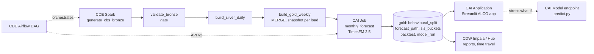
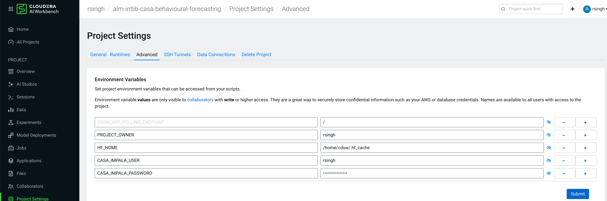

# ALM & IRRBB: CASA Behavioural Forecasting on Cloudera

CASA (current and savings account) deposits have no contractual maturity, so a
bank's Structural Liquidity Statement (ALM) and IRRBB models both depend on a
behavioural assumption: how much of today's balance is stable (core), and for
how long. This project refreshes that assumption every month from governed
Iceberg data, with a zero-shot Google **TimesFM 2.5** forecast and full lineage
from the core banking extract to the ALCO report.

> Demo of the data and modelling pipeline, not a validated regulatory model. It
> covers volume behaviour only; repricing maturity, pass-through and rate
> sensitivity under shocks need further modelling. The bank's model risk and
> ALCO process set the final assumptions.

## Architecture



| Layer | Cloudera service | Code |
|---|---|---|
| Ingest + medallion | CDE Spark, Iceberg | `cde/jobs/` |
| Orchestration | CDE Airflow | `cde/dags/casa_alm_dag.py` |
| Forecast + core split | CAI Job | `cai/jobs/monthly_forecast.py` |
| What-if API | CAI Model Deployment | `cai/model/predict.py` |
| Reports, time travel | CDW Impala (Hue) | `sql/reports.sql` |
| Demo UI | CAI Application | `app/` |

Databases: `rsingh_casa_alb_bronze`, `_silver`, `_gold`, `_ref` (prefix in
`config/casa.yaml`, and `--db-prefix` / `DB_PREFIX` for the CDE side).

| Table | Written by | Grain |
|---|---|---|
| `bronze.cbs_daily_balance` | CDE generate | account × day (synthetic CBS extract, ~2.5M rows) |
| `ref.casa_segment_map` | CDE generate | product × customer type → segment, IRRBB category |
| `silver.casa_daily_balance` | CDE silver | segment × day |
| `gold.casa_weekly_balance` | CDE gold (MERGE) | segment × Sat–Fri week, INR crore |
| `gold.casa_behavioural_split` | CAI job | as-of × segment: core share, cap, core / non-core |
| `gold.casa_forecast_path` | CAI job | as-of × segment × week: P10 / P50 / P90 |
| `gold.casa_sls_buckets` | CAI job | as-of × segment × RBI bucket × component |
| `gold.casa_backtest_metrics` | CAI job | as-of × segment × cut-off |
| `gold.casa_model_run` | CAI job | as-of: model revision, input snapshot id, trust number |

## Method

Set in `config/policy.yaml`:

- **Core share (model)** = lowest P10 over the next 52 weeks ÷ today's balance.
- **Core share** = min(model share, BCBS d368 cap): retail transactional 90%,
  retail non-transactional 70%, wholesale 50%. Non-core is slotted overnight for IRRBB.
- **SLS slotting** of today's balance, always adding back to it:
  run-off to the running minimum of the P10 path goes into Day 1 to 1 year by the
  week it happens; the balance the model calls stable but the cap does not allow
  goes into Day 1; core is spread over 1–3y / 3–5y / 5y+ with category weights
  whose average maturity stays within the BCBS limit (5 / 4.5 / 4 years).
- **Trust number**: rolling-origin backtests (4 cut-offs × 13 hidden weeks). The share of
  actual segment-weeks above P10 should be about 90%; inside P10–P90 about 80%.

Synthetic data: 14 segments from April 2021, with trend, salary cycle,
quarter-end and March spikes, festival season, the 2022–23 rate-hike outflow
and partial return after the 2025 cuts. HNI savings has been in structural
decline since mid-2025 and interbank current accounts are very volatile, so
some segments sit below their cap. History is prefix-stable: a later as-of
date only adds weeks, like real monthly loads.

## Run locally

Python 3.11 and Java 17.

```bash
python3.11 -m venv .venv && .venv/bin/pip install -r requirements-dev.txt
export HF_HOME=$PWD/.hf_cache

# CDE jobs on local Spark + Iceberg, then export gold weekly to data/parquet
.venv/bin/python scripts/run_cde_local.py all                 # as of yesterday
.venv/bin/python scripts/run_cde_local.py history             # Iceberg snapshots

# CAI jobs on parquet (first run downloads TimesFM, ~900 MB)
.venv/bin/python cai/jobs/backfill_alco_history.py --months 6 --backend parquet
.venv/bin/python cai/jobs/monthly_forecast.py --backend parquet
.venv/bin/python cai/model/test_endpoint.py --local --backend parquet --segment SA_RETAIL_URBAN --stress-cut 0.10

CASA_STORAGE_BACKEND=parquet .venv/bin/streamlit run app/streamlit_app.py
.venv/bin/pytest -q
```

## Deploy on Cloudera

### 1. CDE: Spark jobs and Airflow DAG

CDE CLI configured for the vcluster (`~/.cde/config.yaml`), repo pushed to GitHub.

```bash
./cde/scripts/deploy_jobs.sh      # CDE Repository rsingh-casa-alb-pipeline + 4 Spark jobs
./cde/scripts/deploy_dag.sh       # Airflow job rsingh-casa-alb-orchestration
./cde/scripts/backfill_drill.sh   # optional: 6 month-end loads = 6 gold snapshots
```

After a code change: `git push`, then `cde repository sync --name rsingh-casa-alb-pipeline`
(re-run `deploy_dag.sh` if the DAG changed). On a shared vcluster the first job
after idle can wait 20+ minutes for scale-up (`cde run describe --id <id>` shows
`waiting-for-scale-up`).

### 2. CAI project and session

New project `alm-casa-timesfm` from this Git repo, Python 3.11 runtime. Project
Settings > Advanced > environment variables (inherited by sessions, jobs, models
and apps; restart a running session after changing them):

| Variable | Value |
|---|---|
| `HF_HOME` | `/home/cdsw/.hf_cache` |
| `CASA_IMPALA_USER` / `CASA_IMPALA_PASSWORD` | workload user / password (LDAP) |
| `CASA_IMPALA_HOST` | only if not the VW host in `config/casa.yaml` |



Session terminal:

```bash
git pull
pip3 install -r requirements.txt
python -c "import timesfm, torch; print('ok', torch.__version__, hasattr(timesfm, 'TimesFM_2p5_200M_torch'))"

# reads gold via Impala, downloads TimesFM once (~900 MB), backtest + forecast, writes nothing
python cai/jobs/monthly_forecast.py --dry-run

# endpoint logic in-process, 10% stress over 8 weeks
python cai/model/test_endpoint.py --local --segment SA_RETAIL_URBAN --stress-cut 0.10
```

### 3. CAI Job

Jobs > New Job:

- Name `casa-monthly-forecast`, script `cai/jobs/monthly_forecast.py`
- Arguments empty (Airflow passes `--as-of` and `--triggered-by airflow`)
- Python 3.11, 2 vCPU / 8 GB, schedule Manual

Run it once (about 3 minutes); it writes a run with `triggered_by = cai-job`.
For history without Airflow: run `cai/jobs/backfill_alco_history.py --months 6` once.

### 4. CAI Model Deployment

Model Deployments > New Model:

- Name `casa-behavioural-model`, file `cai/model/predict.py`, function `predict`
- Python 3.11, 2 vCPU / 8 GB, 1 replica, authentication on
- Example input: the output of `python cai/model/test_endpoint.py --print-request`

The build runs `cdsw-build.sh` (CPU-only torch); the first start downloads TimesFM,
so allow a few extra minutes. Test with the same JSON in the Test tab. Shape:

```json
{"horizon_weeks": 52, "stress": {"weeks": 8, "cut": 0.10},
 "segments": [{"segment_id": "SA_RETAIL_URBAN", "irrbb_category": "retail_transactional",
               "weekly_balance_inr_cr": [52 or more weekly values, oldest first]}]}
```

### 5. CAI Application

Applications > New Application: name `CASA ALCO`, subdomain `casa-alco`, script
`app/run.py`, Python 3.11, 2 vCPU / 4 GB. Application environment variables, so
stress what-ifs call the model endpoint:

| Variable | Where to find it |
|---|---|
| `CASA_ENDPOINT_URL` | model Overview, URL in the sample curl (`https://modelservice.<domain>/model`) |
| `CASA_ENDPOINT_ACCESS_KEY` | model Settings |
| `CASA_ENDPOINT_API_KEY` | User Settings > API Keys, Model API key (authentication is on) |

Without these the stress tab runs TimesFM inside the app; give it 8 GB then.

### 5a. Airflow triggers the CAI Job

Print the IDs in a session:

```bash
python - <<'EOF'
import os, cmlapi
c = cmlapi.default_client()
pid = os.environ["CDSW_PROJECT_ID"]
print("CASA_CAI_HOST       =", "https://" + os.environ["CDSW_DOMAIN"])
print("CASA_CAI_PROJECT_ID =", pid)
for j in c.list_jobs(pid).jobs:
    print("CASA_CAI_JOB_ID     =", j.id, "(", j.name, ")")
EOF
```

Create an API v2 key (User Settings > API Keys), then in the CDE Airflow UI >
Admin > Variables set `CASA_CAI_HOST`, `CASA_CAI_PROJECT_ID`, `CASA_CAI_JOB_ID`
and `CASA_CAI_API_KEY`. Without `CASA_CAI_HOST` the DAG skips the CAI step.
Then trigger the DAG month by month with `{"as_of": "2026-03-31"}` and so on,
finishing with the latest week (empty `as_of`), so each ALCO run records its own
gold snapshot.

### 6. Run anywhere else

The app has no Cloudera-only dependency: `docker build -t casa-alm-app .` and run
it on parquet exports or against CDW Impala; stress what-ifs call the CAI endpoint
if `CASA_ENDPOINT_URL` is set (see `Dockerfile`).

## Layout

```
casa/          shared logic: config, TimesFM wrapper, core split + SLS, backtest, storage, scoring
cde/jobs/      Spark jobs (self-contained, PySpark + stdlib only)
cde/dags/      Airflow DAG
cde/scripts/   deploy_jobs.sh, deploy_dag.sh, backfill_drill.sh
cai/jobs/      monthly_forecast.py, backfill_alco_history.py
cai/model/     predict.py (endpoint), test_endpoint.py
app/           Streamlit app + CAI launcher
config/        casa.yaml (names, storage, model), policy.yaml (caps, buckets, slotting)
sql/           Hue report and time-travel queries
docs/          demo runbook
scripts/       run_cde_local.py (CDE jobs on a laptop)
```

## Sources

- [BCBS IRRBB standards (d368)](https://www.bis.org/bcbs/publ/d368.htm)
- [TimesFM 2.5 model card](https://huggingface.co/google/timesfm-2.5-200m-pytorch)
- [Cloudera AI: creating and deploying a model](https://docs.cloudera.com/machine-learning/cloud/models/index.html)
